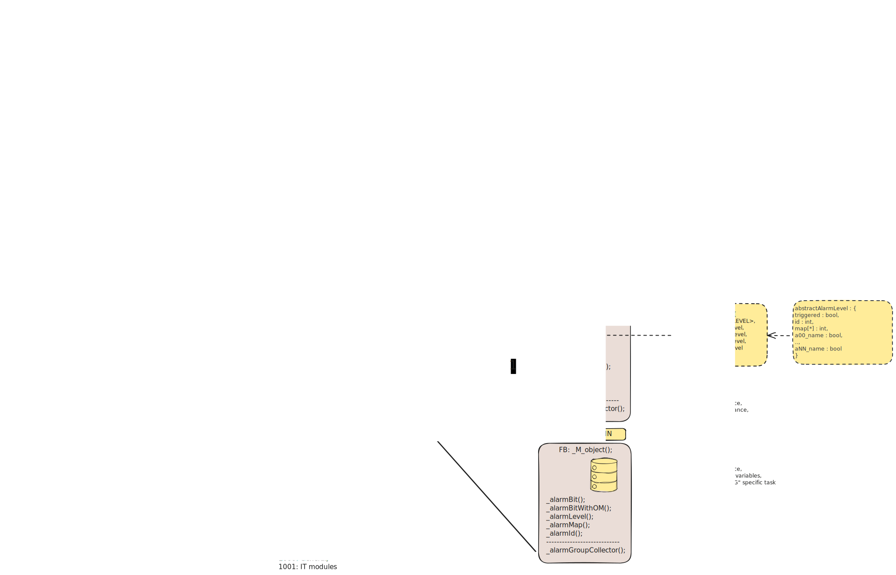

# Library

## Call Hierarchy

### Set alarm in object

#### Set alarm bit

| Function | Dependencies |
|:-------|:-------------|
| _alarmBit | - |
| _alarmBitWithOm | - |

#### Set alarm ID

| Function | Dependencies |
|:-------|:-------------|
| _alarmBit01Id | - |
| _alarmBit02Id | - |
| _alarmBit04Id | - |
| _alarmBit08Id | - |
| _alarmBit16Id | - |

#### Set alarm bit in map

| Function | Dependencies |
|:-------|:-------------|
| _alarmBitMap | - |

#### Set alarm level

| Function | Dependencies |
|:-------|:-------------|
| _alarmBitLevel | - |

#### Set alarm for Safety

| Function | Dependencies |
|:-------|:-------------|
| _alarmBitForSafety | _alarmBit |

### Alarm Trace

| Trace level | Function/Type | Dependencies |
|:------|:-------|:-------------|
| Object | abstractAlarmLevel | - |
| Object | abstractAlarmData | abstractAlarmLevel |
||||
| Group | alarmTraceGroupLevel | - |
| Group | alarmTraceGroupData | alarmTraceGroupLevel |
| Group | _alarmTraceGroupCollector | alarmTraceGroupData |
| Group | _alarmTraceGroupUpdater | alarmTraceGroupData |
||||
| Super | alarmTraceSuperLevel | - |
| Super | alarmTraceSuperData | alarmTraceSuperLevel |
| Super | _alarmTraceSuperCollector | alarmTraceGroupData   alarmTraceSuperData |
| Super | _alarmTraceSuperUpdater | alarmTraceSuperData |
||||
| Global | alarmTraceGlobalLevel | - |
| Global | alarmTraceGlobalData | alarmTraceGlobalLevel |
| Super | _alarmTraceGlobalCollector | alarmTraceSuperData   alarmTraceGlobalData |
| Super | _alarmTraceGlobalUpdater | alarmTraceGlobalData |

## Integration Layout

