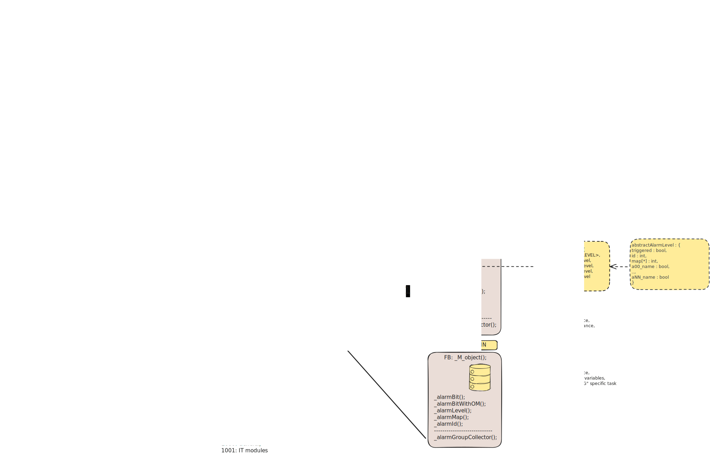

# Alarm Library

## Data types

| Data type | Dependency |
|:----------|:-----------|
| abstractAlarmLevel | - |
| abstractAlarmData | abstractAlarmLevel |
| alarmTraceGroupLevel | - |
| alarmTraceGroupData | alarmTraceGroupLevel |
| alarmTraceSuperLevel | - |
| alarmTraceSuperData | alarmTraceSuperLevel | 
| alarmTraceGlobalLevel | - |
| alarmTraceGlobalData | alarmTraceGlobalLevel |

## Functions

| Use | Function | Dependency |
|:----|:---------|:-----------|
| Set alarm bit | _alarmBit | |
| Set alarm bit | _alarmBitWithOm | |
| Set alarm bit | _alarmBitForSafety | _alarmBit |
| | | |
| Set alarm word | _alarmBitMap | |
| | | |
| Set alarm ID | _alarmBit01Id | - |
| Set alarm ID | _alarmBit02Id | - |
| Set alarm ID | _alarmBit04Id | - |
| Set alarm ID | _alarmBit08Id | - |
| Set alarm ID | _alarmBit16Id | - |
| | | |
| Set alarm level | _alarmBitLevel | - |
| | | |
| Update | _alarmTraceGroupUpdater | alarmTraceGroupData |
| Collect | _alarmTraceGroupCollector | alarmTraceGroupData |
| Update | _alarmTraceSuperUpdater | alarmTraceSuperData | 
| Collect | _alarmTraceSuperCollector | alarmTraceGroupData   alarmTraceSuperData |
| Update | _alarmTraceGlobalUpdater | alarmTraceGlobalData |
| Collect | _alarmTraceGlobalCollector | alarmTraceSuperData   alarmTraceGlobalData |

## Call order

| Super | Group | Object | Function | Comment |
|:-----:|:-----:|:------:|:---------|:--------|
| |
| | | | | __Main Subroutine__ | |
| |
| * | * | * | _alarmTraceGlobalUpdater | Called on top one time |
| 1..s | * | * | _alarmTraceSuperUpdater | Called on top one time |
| |
| | | | __ESC01__ | First super group |
| 1 | 1..g | * | _alarmTraceGroupUpdater | Called on top of each super (ESC) |
| | | | __ESC01/Group1__ | First group in super group |
| 1 | 1 | 1 | _alarmTraceGroupCollector | Called at the end of each object alarm handling |
| 1 | 1 | o | _alarmTraceGroupCollector | Called at the end of each object alarm handling |
| 1 | 1 | * | _alarmTraceSuperCollector | Called at the end of each group |
| | | | __ESC01/GroupG__ | Nth group in super group |
| 1 | g | o | _alarmTraceGroupCollector | Called at the end of each object alarm handling |
| 1 | g | o | _alarmTraceGroupCollector | Called at the end of each object alarm handling |
| 1 | g | * | _alarmTraceSuperCollector | Called at the end of each group |
| |
| 1 | * | * | _alarmTraceGlobalCollector | Called at the end of each super (ESC) |
| |
| | | | __ESCx__ | Nth super group |
| s | 1..g | * | _alarmTraceGroupUpdater | Called on top of each super (ESC) |
| | | | __ESCs/Group1__ | First group in super group |
| s | 1 | o | _alarmTraceGroupCollector | Called at the end of each object alarm handling |
| s | 1 | o | _alarmTraceGroupCollector | Called at the end of each object alarm handling |
| s | 1 | * | _alarmTraceSuperCollector | Called at the end of each group |
| | | | __ESCs/GroupG__ | Nth group in super group |
| s | g | o | _alarmTraceGroupCollector | Called at the end of each object alarm handling |
| s | g | o | _alarmTraceGroupCollector | Called at the end of each object alarm handling |
| s | g | * | _alarmTraceSuperCollector | Called at the end of each group |
| |
| s | * | * | _alarmTraceGlobalCollector | Called at the end of each super (ESC) |

## Integration Layout

